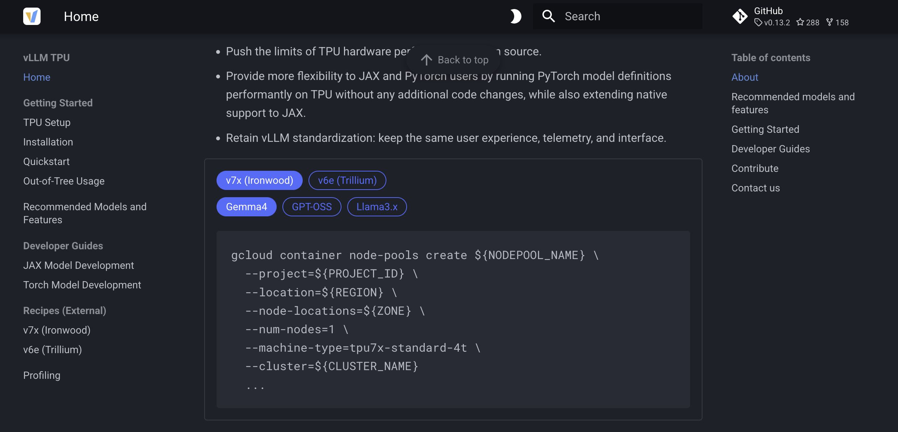

# mkdocs-command-generator

This MkDocs plugin allows you to create tables with commands that can be easily
copied by users. You can define the commands in a simple markdown format, and
the plugin will generate a theme-compatible table with code snippets.



The formula for defining commands is as follows:

- In your markdown file use the `--cmd-gen<--` and `-->cmd-gen--` markers to
  indicate the start and end of the command definitions.
- Each command definition should be on a new line and follow the format:
  ```
  - <row-1>,<row-2>,...:
    <command-1>
    <command-2>
    ...
  ```
  where `<row-1>,<row-2>,...` are the labels for the rows in the table, and
  `<command-1>`, `<command-2>`, etc. are the commands that will be displayed
  in the corresponding cells of the table.
- You don't need to specify all possible combinations of rows. The plugin will
  automatically generate _"This configuration is not supported."_ for any missing
  combinations.

```md
--cmd-gen<--
- v7x (Ironwood),Gemma4:
  gcloud container node-pools create ${NODEPOOL_NAME} \
    --project=${PROJECT_ID} \
    --machine-type=tpu7x-standard-4t \
    ...
- v7x (Ironwood),GPT-OSS:
  gcloud container node-pools create ${NODEPOOL_NAME} \
    --project=${PROJECT_ID} \
    --model=openai/gpt-oss-120b
    ...
- v6e (Trillium),Llama3.x:
  gcloud alpha compute tpus tpu-vm create $TPU_NAME \
    --type v6e --topology 2x4 \
    --project $PROJECT --zone $ZONE --version v2-alpha-tpuv6e
  vllm serve meta-llama/Llama-3.3-70B-Instruct
- v6e (Trillium),Gemma4:
  gcloud alpha compute tpus tpu-vm create $TPU_NAME \
    --type v6e --topology 2x4 \
    --project $PROJECT --zone $ZONE --version v2-alpha-tpuv6e
  vllm serve google/gemma-4-31B-it
-->cmd-gen--
```

## Installation

You can install the plugin using pip:

```bash
pip install mkdocs-command-generator
```

and then add it to your `mkdocs.yml` configuration file:

```yaml
plugins:
  ...
  - command-generator
```
